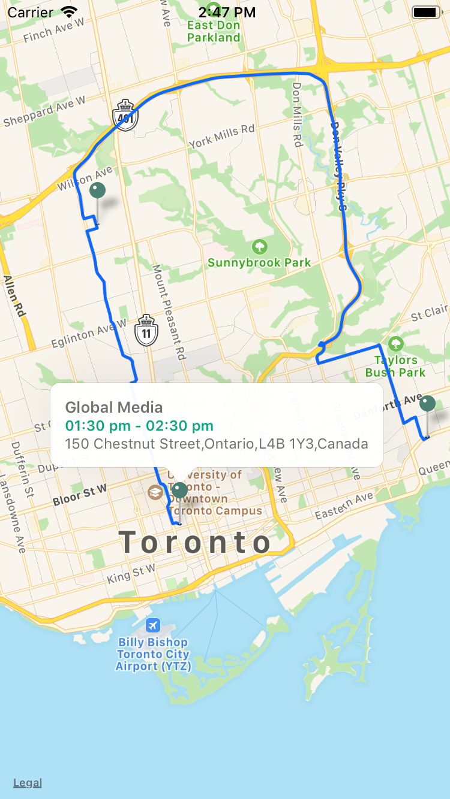

## React-Native-Maps with route information.
Using 
for showing maps, in iOS it uses Apple maps and in Android google maps is displayed.

Used google api to fetch the route information for the event waypoint.

## Development Setup Instructions

- Clone the repository above
- Using Terminal, cd into the `GoogleMapAsset` directory
- run `yarn install` to install dependency
- Run this command: `react-native link` to link Assets to ios/android and React native libraries
- run `yarn start` and In another tab, run `yarn ios` for iPhone and `yarn ipad` for iPad or open the `jti-sales.xcworkspace` file within XCode and run project from there

### Google Maps integration

1.  You need a Google Maps API Key, there is a shared one at the end of this README, but if its daily quota is used up, then you need to follow the next section to get a new one for yourself. You may move on to the next step once you have the key ready.
2.  Create a .env file at the root of the project folder with these 2 variables

    `GOOGLE_MAPS_API_KEY='PASTE_THE_KEY_HERE'`

  

